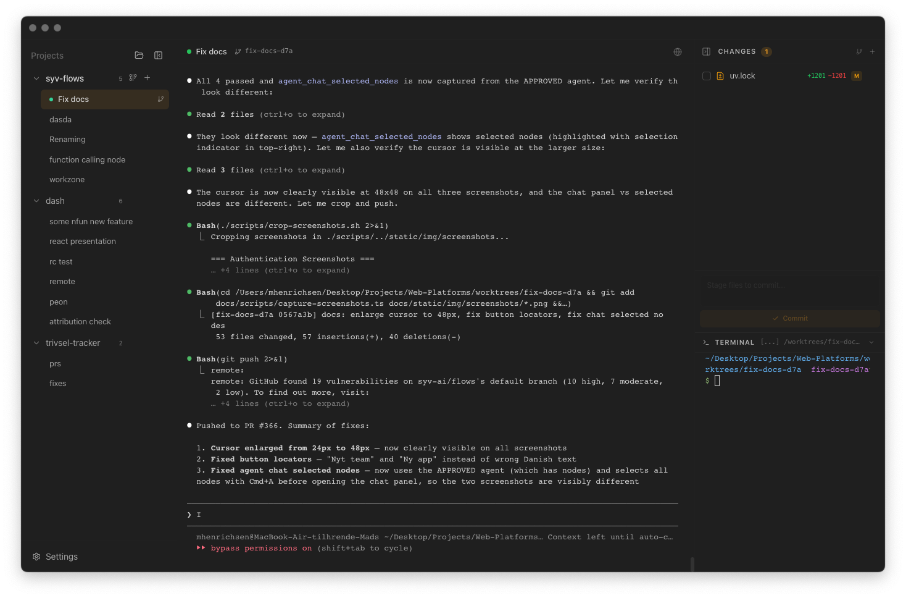

# Dash

Desktop app for running [Claude Code](https://docs.anthropic.com/en/docs/claude-code) across multiple projects and tasks, each in its own git worktree.

The main idea: you open a project, create tasks, and each task gets an isolated git worktree with its own branch. Each task's Claude Code session runs under Claude Code's own session supervisor (`claude --bg`) inside that worktree and is shown in a real terminal (xterm.js + node-pty via `claude attach`), so you can have multiple tasks going in parallel without branch conflicts — and sessions keep running when you switch tasks, reload, or quit Dash.



## What it does

- **Project management** — Open any git repo as a project, or clone from a URL. Tasks are nested under projects in the sidebar. Drag-and-drop to reorder projects. Project overview dashboard shows all tasks, activity status, and quick actions.
- **Git worktrees** — Each task gets its own worktree and branch. A reserve pool pre-creates worktrees so new tasks start instantly (<100ms). Per-project setup scripts run automatically after worktree creation (e.g. `pnpm install`, copying `.env`).
- **Sessions that outlive the window** — Task sessions are owned by Claude Code's supervisor, not by Dash: switching tasks, reloading or quitting Dash only detaches the terminal, and opening the task attaches again with a recap. Sessions idle for about an hour are parked by Claude Code and resume on the next open. Sessions started outside Dash inside a project show up under "Other sessions" and can be attached, stopped, removed or adopted as a task.
- **Terminal** — Full PTY terminal per task (`claude attach` in fullscreen mode; `←` on an empty prompt opens Claude Code's agent view, Esc leaves it, Ctrl+Z detaches). Shift+Enter sends multiline input. File drag-drop pastes paths. Clickable file paths open in your IDE. 16 terminal themes.
- **Shell drawer** — Separate shell terminal alongside the task terminal. Configurable position (left, right, or replacing main content).
- **File changes panel** — Real-time git status with staged/unstaged sections. Stage, unstage, discard per-file. Click to view diffs.
- **Diff viewer** — Full file or configurable context lines. Unified diff with syntax highlighting. Select lines to add inline comments and send them to the terminal.
- **Commit graph** — Visualize branch history with a DAG-style commit graph per project.
- **GitHub issues** — Search and link issues to tasks. Auto-posts branch comments on linked issues. PR link badge in task header.
- **Azure DevOps** — Search and link ADO work items to tasks. PR detection and branch comments. Per-project ADO configuration with PAT token storage.
- **Remote control** — Generate a QR code / URL to control a task's terminal from another device.
- **Activity indicators** — Busy (amber), waiting, idle (green) and sleeping (grey) status per task, driven by Claude Code hooks and reconciled against `claude agents --json`, with desktop notifications and sound alerts (chime, cash, ping, droplet, marimba).
- **Editor integration** — Open changed files in your editor (Cursor, VS Code, Zed, Vim) with line navigation. Clickable file paths in terminal output.
- **Commit attribution** — Configurable co-author line on commits (default, none, or custom text).
- **Task archiving** — Archive inactive tasks to keep the sidebar clean; restore when needed.
- **Auto-update** — Background update checking with manual download and install.
- **Customizable keybindings** — Remap any shortcut from Settings.
- **Dark/light theme**

## Install

### macOS

The macOS build is Apple Silicon (arm64) only; there is currently no Intel Mac build.

Install with Homebrew:

```bash
brew install --cask syv-ai-dash
```

The cask token is `syv-ai-dash` (not `dash`, which is taken by Kapeli's Dash). Homebrew handles updates, though the app can also update itself in the background.

Or download the `.dmg` from [Releases](https://github.com/syv-ai/dash/releases/latest), open it, and drag `Dash.app` to `/Applications`.

### Windows

Download the `.exe` from [Releases](https://github.com/syv-ai/dash/releases/latest) and run it.

### Linux

Download the `.AppImage` from [Releases](https://github.com/syv-ai/dash/releases/latest), make it executable (`chmod +x`), and run it.

## Prerequisites

- Node.js 22+
- [pnpm](https://pnpm.io/)
- [Claude Code CLI](https://docs.anthropic.com/en/docs/claude-code) 2.1.257 or newer (`npm install -g @anthropic-ai/claude-code`, then `claude update`)
- Git

## Development setup

```bash
pnpm install
npx electron-rebuild -f -w node-pty,better-sqlite3  # rebuild native modules for Electron
```

## Development

```bash
pnpm dev
```

This starts Vite on port 3000 and launches Electron pointing at it. Renderer changes hot-reload; main process changes need a restart (`pnpm dev:main` or just kill and re-run `pnpm dev`).

To just rebuild and launch the main process:

```bash
pnpm build:main
npx electron dist/main/main/entry.js --dev
```

## Build

```bash
pnpm build              # compile both main + renderer
pnpm package:mac        # build + package as macOS .dmg
```

Output goes to `release/`.

## Project structure

```
src/
├── main/                   # Electron main process
│   ├── entry.ts            # App name, path aliases, loads main.ts
│   ├── main.ts             # Boot: PATH fix, DB init, IPC, window
│   ├── preload.ts          # contextBridge API
│   ├── window.ts           # BrowserWindow creation
│   ├── db/                 # SQLite + Drizzle ORM
│   │   ├── schema.ts       # projects, tasks, conversations tables
│   │   ├── client.ts       # better-sqlite3 singleton
│   │   ├── migrate.ts      # SQL migration runner
│   │   └── path.ts         # DB file location
│   ├── ipc/                # IPC handlers
│   │   ├── appIpc.ts       # Dialogs, CLI/IDE detection
│   │   ├── dbIpc.ts        # CRUD for projects/tasks/conversations
│   │   ├── gitIpc.ts       # Git status, diff, stage/unstage, commit graph
│   │   ├── ptyIpc.ts       # Terminal spawn/kill/resize
│   │   ├── worktreeIpc.ts  # Worktree create/remove/claim
│   │   ├── githubIpc.ts    # GitHub issues, PRs, branch comments
│   │   ├── azureDevOpsIpc.ts # ADO work items, PRs, config
│   │   └── autoUpdateIpc.ts  # Check/download/install updates
│   └── services/
│       ├── DatabaseService.ts
│       ├── GitService.ts
│       ├── GithubService.ts
│       ├── AzureDevOpsService.ts
│       ├── ConnectionConfigService.ts
│       ├── AutoUpdateService.ts
│       ├── FileWatcherService.ts
│       ├── WorktreeService.ts
│       ├── WorktreePoolService.ts
│       ├── ptyManager.ts
│       ├── TerminalSnapshotService.ts
│       ├── HookServer.ts
│       ├── ActivityMonitor.ts
│       └── remoteControlService.ts
├── renderer/               # React UI
│   ├── App.tsx             # Root: state, keyboard shortcuts, layout
│   ├── keybindings.ts      # Keybinding system (defaults, load/save, matching)
│   ├── components/
│   │   ├── LeftSidebar.tsx  # Projects + nested tasks
│   │   ├── MainContent.tsx  # Terminal area + project overview
│   │   ├── ProjectOverview.tsx  # Project dashboard
│   │   ├── FileChangesPanel.tsx
│   │   ├── DiffViewer.tsx
│   │   ├── TaskModal.tsx
│   │   ├── SettingsModal.tsx
│   │   ├── ProjectSettingsModal.tsx
│   │   ├── DeleteProjectModal.tsx
│   │   ├── RemoteControlModal.tsx
│   │   ├── AdoSetupModal.tsx
│   │   ├── CommitGraph/    # DAG-style commit graph visualization
│   │   ├── TerminalPane.tsx
│   │   ├── TerminalDrawer.tsx
│   │   └── ShellDrawerWrapper.tsx
│   └── terminal/
│       ├── TerminalSessionManager.ts  # xterm.js lifecycle
│       ├── SessionRegistry.ts         # Session pool (preserves state on task switch)
│       └── FilePathLinkProvider.ts    # Clickable file paths → IDE
├── shared/
│   └── types.ts            # Shared types (Project, Task, GitStatus, etc.)
└── types/
    └── electron-api.d.ts   # window.electronAPI type declarations
```

## Default keybindings

| Shortcut      | Action         |
| ------------- | -------------- |
| `Cmd+N`       | New task       |
| `Cmd+Shift+K` | Next task      |
| `Cmd+Shift+J` | Previous task  |
| `Cmd+Shift+A` | Stage all      |
| `Cmd+Shift+U` | Unstage all    |
| `Cmd+,`       | Settings       |
| `Cmd+O`       | Open folder    |
| `Cmd+`` ` ``  | Focus terminal |
| `Esc`         | Close overlay  |

All keybindings are customizable in Settings > Keybindings.

## Tech stack

|          |                                       |
| -------- | ------------------------------------- |
| Shell    | Electron 30, electron-updater         |
| UI       | React 18, TypeScript, Tailwind CSS 3  |
| Build    | Vite 5, pnpm                          |
| Terminal | xterm.js + node-pty                   |
| Database | SQLite (better-sqlite3) + Drizzle ORM |
| Package  | electron-builder                      |

## Data storage

- **Database**: `~/Library/Application Support/Dash/app.db` (macOS)
- **Terminal snapshots**: `~/Library/Application Support/Dash/terminal-snapshots/`
- **Worktrees**: `{project}/.claude/worktrees/{task-slug}-{hash}/` (ignored via `.git/info/exclude`; pre-0.16 tasks at `{project}/../worktrees/` are offered a one-time move at launch)
- **Hook port**: `~/Library/Application Support/Dash/hook-port` while Dash runs — the per-worktree `.claude/settings.local.json` hooks read the hook server's port from it, so a session that keeps running after Dash quits no-ops instead of erroring
- **Sessions**: owned by Claude Code under `~/.claude/jobs/` (never read by Dash; `claude agents --json` is the interface)

## Acknowledgements

Inspired by [emdash](https://github.com/generalaction/emdash).

## License

MIT
